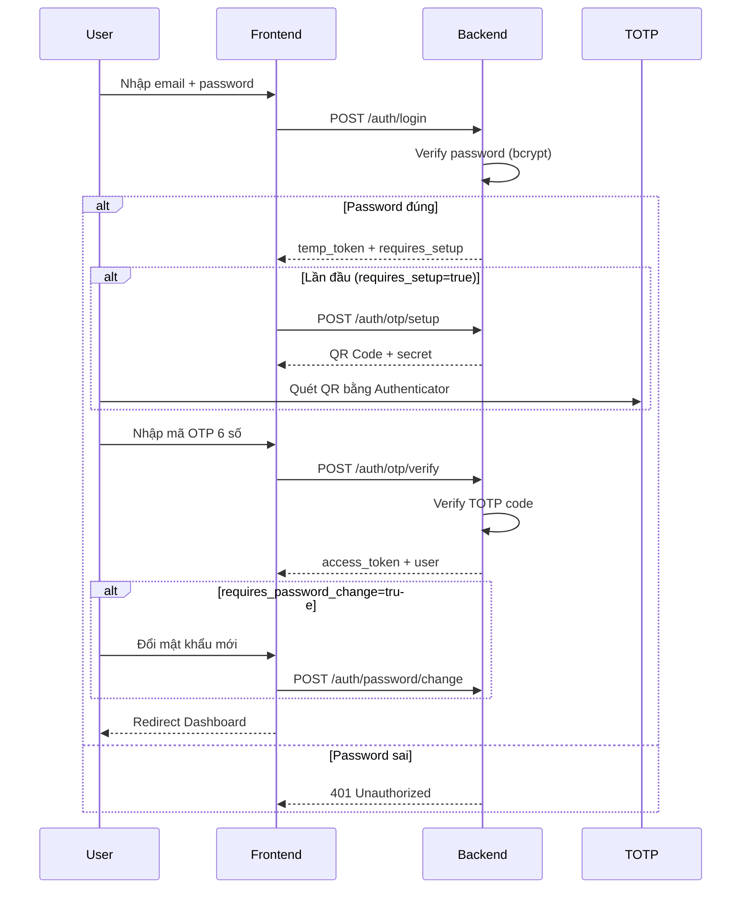

# Authentication - Luồng Đăng nhập và Xác thực

## 📋 Tổng quan

Hệ thống sử dụng **JWT + TOTP 2FA** để xác thực. Tất cả users đều phải xác thực OTP sau khi nhập email/password.

```
Authorization: Bearer <access_token>
```

---

## 🔐 Luồng đăng nhập (OTP 2FA)



---

## 🛡️ OTP API Endpoints

| Endpoint | Method | Mô tả |
|----------|--------|-------|
| `/auth/login` | POST | Bước 1: Email + Password → temp_token |
| `/auth/otp/setup` | POST | Lấy QR code (lần đầu) |
| `/auth/otp/verify` | POST | Bước 2: Verify OTP → access_token |
| `/auth/password/change` | POST | Đổi mật khẩu (lần đầu) |
| `/auth/otp/reset/{id}` | POST | Admin reset OTP cho user |
| `/auth/password/reset/{id}` | POST | Admin reset password (về 123456) |
| `/auth/reset-all/{id}` | POST | Admin reset cả OTP và Password |

## ⚙️ Cấu hình OTP (Bật/Tắt)

Có thể bật/tắt tính năng OTP thông qua biến môi trường `OTP_ENABLED` trong `.env` của Backend:

```env
# Bật OTP (Mặc định) - User phải nhập OTP mới có access_token
OTP_ENABLED=true

# Tắt OTP - Login trả về access_token ngay lập tức
OTP_ENABLED=false
```

Khi `OTP_ENABLED=false`:
- API `/auth/login` sẽ trả về `token` và `user` ngay trong response.
- Frontend sẽ tự động đăng nhập mà không cần chuyển sang màn hình nhập OTP.

### POST /auth/login

**Request:**
```json
{"email": "admin@example.com", "password": "admin123"}
```

**Response:**
```json
{
  "success": true,
  "data": {
    "requires_otp": true,
    "requires_setup": true,      // true nếu otp_verified=false → hiện QR
    "requires_password_change": true, // true nếu must_change_password=true
    "temp_token": "eyJ...",
    "user_email": "admin@example.com"
  }
}
```

> **Logic `requires_setup`**: Dựa vào `otp_verified` (không phải `otp_enabled`)
> - `otp_verified=false` → `requires_setup=true` → Hiện QR code
> - `otp_verified=true` → `requires_setup=false` → Chỉ nhập OTP

### POST /auth/otp/setup

**Request:**
```json
{"temp_token": "eyJ..."}
```

**Response:**
```json
{
  "success": true,
  "data": {
    "qr_code_base64": "iVBORw0KGgo...",
    "secret": "JBSWY3DPEHPK3PXP",
    "otpauth_url": "otpauth://totp/CreditApp:admin@example.com?secret=..."
  }
}
```

### POST /auth/otp/verify

**Request:**
```json
{"temp_token": "eyJ...", "code": "123456"}
```

**Response:** Full user data + access_token

---

## 🗂️ Các file liên quan

### Backend

| File | Mô tả |
|------|-------|
| `app/routers/auth.py` | API endpoints (login, OTP, password) |
| `app/services/otp_service.py` | TOTP generation, verification, QR code |
| `app/core/security.py` | Hash password, JWT token |
| `app/core/deps.py` | Dependencies: get_current_user, require_role |
| `app/models/user.py` | User model với OTP fields |

### Frontend

| File | Mô tả |
|------|-------|
| `src/app/login/page.tsx` | Login page với OTP flow |
| `src/services/authApi.ts` | Auth API service + OTP methods |
| `src/providers/AuthContext.tsx` | Auth context provider |

---

## 🔑 User Model - OTP Fields

```python
class User(Base):
    # ... basic fields ...
    
    # OTP/2FA (Tạo sẵn khi user được tạo)
    otp_secret = Column(String)          # TOTP secret (tạo khi register)
    otp_enabled = Column(Boolean, default=True)   # Luôn true cho user mới
    otp_verified = Column(Boolean, default=False) # False = hiện QR, True = chỉ nhập OTP
    must_change_password = Column(Boolean, default=True)  # Đổi MK lần đầu
    
    # Telegram
    telegram_chat_id = Column(String, nullable=True, unique=True)
    telegram_verified = Column(Boolean, default=False)
```

---

## 🛡️ Phân quyền (Authorization)

### Các vai trò (Roles)

| Role | Mô tả |
|------|-------|
| `admin` | Toàn quyền CRUD, quản lý users |
| `collector` | Xem, tạo hợp đồng, nộp lãi |
| `debtor` | Xem thông tin nợ cá nhân |

### Dependencies phân quyền

```python
# backend/app/core/deps.py
require_admin = require_role([UserRole.ADMIN])
require_collector = require_role([UserRole.COLLECTOR])
require_debtor = require_role([UserRole.DEBTOR])
require_admin_or_collector = require_role([UserRole.ADMIN, UserRole.COLLECTOR])
```

---

## 💾 Frontend Token Management

```typescript
// frontend/src/services/authApi.ts

// Login Step 1
static async loginStep1(credentials): Promise<LoginStep1Response>

// Get QR Code
static async getOTPSetup(tempToken): Promise<OTPSetupResponse>

// Verify OTP & Complete Login
static async verifyOTP(tempToken, code): Promise<UserWithToken>

// Change Password
static async changePassword(current, new): Promise<void>
```

---

## 🔒 Security Notes

- **TOTP time window**: 30 giây (chuẩn RFC 6238)
- **Tolerance**: ±1 period (chống clock skew)
- **Password**: bcrypt hashed
- **Token expiry**: 24 giờ (configurable)
- **Temp token expiry**: 5 phút

---

## 📚 Xem thêm

- [add-api.md](add-api.md) - Hướng dẫn thêm API
- [test-api.md](test-api.md) - Hướng dẫn test API
