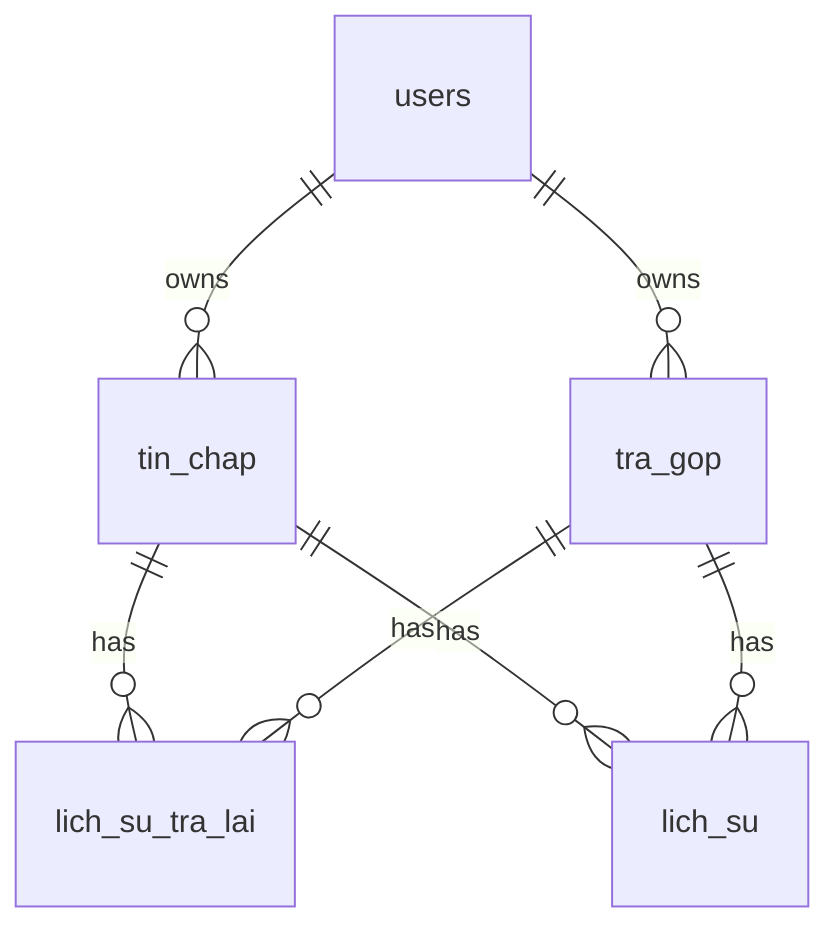

# Database Structure - Cấu trúc Database

## 📋 Tổng quan

Database sử dụng **PostgreSQL** với SQLAlchemy ORM. Các bảng chính:

| Bảng | Mô tả |
|------|-------|
| `users` | Người dùng (admin, collector, debtor) |
| `tin_chap` | Hợp đồng tín chấp |
| `tra_gop` | Hợp đồng trả góp |
| `lich_su_tra_lai` | Lịch sử trả lãi |
| `lich_su` | Lịch sử thao tác |
| `settings` | Cài đặt hệ thống |

---

## 👥 Bảng `users`

Lưu thông tin người dùng.

```sql
CREATE TABLE users (
    id SERIAL PRIMARY KEY,
    ho_ten VARCHAR NOT NULL,
    so_dien_thoai VARCHAR UNIQUE NOT NULL,
    email VARCHAR UNIQUE NOT NULL,
    password_hash VARCHAR NOT NULL,
    role VARCHAR NOT NULL DEFAULT 'debtor',  -- admin, collector, debtor
    is_active BOOLEAN DEFAULT TRUE,
    created_at TIMESTAMP DEFAULT NOW()
);
```

| Field | Type | Mô tả |
|-------|------|-------|
| id | Integer | Primary key, auto increment |
| ho_ten | String | Họ tên |
| so_dien_thoai | String | Số điện thoại (unique) |
| email | String | Email (unique) |
| password_hash | String | Mật khẩu đã hash (bcrypt) |
| role | String | Vai trò: admin/collector/debtor |
| is_active | Boolean | Trạng thái hoạt động |
| created_at | DateTime | Ngày tạo |

---

## 📄 Bảng `tin_chap`

Hợp đồng tín chấp (vay không thế chấp).

```sql
CREATE TABLE tin_chap (
    MaHD VARCHAR PRIMARY KEY,  -- TC001, TC002, ...
    HoTen VARCHAR NOT NULL,
    NgayVay DATE NOT NULL,
    SoTienVay INTEGER NOT NULL,
    KyDong INTEGER NOT NULL,      -- Số ngày giữa các kỳ
    LaiSuat INTEGER NOT NULL,     -- Số tiền lãi cố định mỗi kỳ
    SoTienTraGoc INTEGER DEFAULT 0,
    TrangThai VARCHAR NOT NULL,   -- JSON: ["Chưa thanh toán", "Chưa đến hạn"]
    user_id INTEGER REFERENCES users(id)
);
```

| Field | Type | Mô tả |
|-------|------|-------|
| MaHD | String | Mã hợp đồng (Primary key) - Format: TCXXX |
| HoTen | String | Họ tên người vay |
| NgayVay | Date | Ngày vay |
| SoTienVay | Integer | Số tiền vay (VNĐ) |
| KyDong | Integer | Kỳ đóng lãi (ngày) |
| LaiSuat | Integer | Tiền lãi mỗi kỳ (VNĐ) |
| SoTienTraGoc | Integer | Số tiền đã trả gốc |
| TrangThai | String | Trạng thái thanh toán (JSON array) |
| user_id | Integer | FK → users.id (người nợ) |

**TrangThai format**: `["TrangThaiThanhToan", "TrangThaiNgayThanhToan"]`
- TrangThaiThanhToan: Chưa thanh toán | Đóng đủ | Thanh toán một phần | Đã tất toán
- TrangThaiNgayThanhToan: Chưa đến hạn | Đến hạn | Quá hạn

---

## 📄 Bảng `tra_gop`

Hợp đồng trả góp.

```sql
CREATE TABLE tra_gop (
    MaHD VARCHAR PRIMARY KEY,  -- TG001, TG002, ...
    HoTen VARCHAR NOT NULL,
    NgayVay DATE NOT NULL,
    SoTienVay INTEGER NOT NULL,
    KyDong INTEGER NOT NULL,
    SoLanTra INTEGER NOT NULL DEFAULT 0,  -- Tổng số lần trả
    LaiSuat INTEGER NOT NULL,
    TrangThai VARCHAR NOT NULL,
    user_id INTEGER REFERENCES users(id)
);
```

Tương tự `tin_chap` nhưng có thêm `SoLanTra`.

---

## 📊 Bảng `lich_su_tra_lai`

Lịch sử trả lãi cho từng hợp đồng.

```sql
CREATE TABLE lich_su_tra_lai (
    id SERIAL PRIMARY KEY,
    MaHD VARCHAR NOT NULL,
    LoaiHD VARCHAR NOT NULL,      -- 'tin_chap' hoặc 'tra_gop'
    NgayTraLai DATE NOT NULL,
    SoTienLai INTEGER NOT NULL,
    TrangThai VARCHAR NOT NULL,   -- Đã thanh toán | Chưa thanh toán
    GhiChu VARCHAR,
    created_at TIMESTAMP DEFAULT NOW()
);
```

| Field | Type | Mô tả |
|-------|------|-------|
| id | Integer | Primary key |
| MaHD | String | Mã hợp đồng |
| LoaiHD | String | Loại hợp đồng: tin_chap/tra_gop |
| NgayTraLai | Date | Ngày trả lãi |
| SoTienLai | Integer | Số tiền lãi |
| TrangThai | String | Trạng thái thanh toán |
| GhiChu | String | Ghi chú |
| created_at | DateTime | Thời gian tạo |

---

## 📝 Bảng `lich_su`

Lịch sử các thao tác trong hệ thống.

```sql
CREATE TABLE lich_su (
    id SERIAL PRIMARY KEY,
    MaHD VARCHAR NOT NULL,
    LoaiHD VARCHAR NOT NULL,
    HanhDong VARCHAR NOT NULL,    -- Tạo | Cập nhật | Xóa | Đóng lãi
    ChiTiet TEXT,
    NguoiThucHien VARCHAR,
    created_at TIMESTAMP DEFAULT NOW()
);
```

---

## ⚙️ Bảng `settings`

Cài đặt hệ thống.

```sql
CREATE TABLE settings (
    id SERIAL PRIMARY KEY,
    key VARCHAR UNIQUE NOT NULL,
    value TEXT,
    description VARCHAR,
    updated_at TIMESTAMP DEFAULT NOW()
);
```

**Các settings phổ biến:**
- `vietqr_account_no` - Số tài khoản VietQR
- `vietqr_account_name` - Tên tài khoản
- `vietqr_bank_id` - Mã ngân hàng
- `telegram_bot_token` - Token bot Telegram
- `telegram_chat_id` - Chat ID nhận thông báo

---

## 🔗 Relationships



---

## 🛠️ Database Operations

### Connect to database

```bash
# Via Docker
docker exec -it app_credit_db psql -U postgres -d app

# Direct connection
psql -h localhost -p 5436 -U postgres -d app
```

### Common queries

```sql
-- Xem tất cả hợp đồng tín chấp
SELECT * FROM tin_chap;

-- Hợp đồng quá hạn
SELECT * FROM tin_chap WHERE "TrangThai" LIKE '%Quá hạn%';

-- Lịch sử trả lãi của 1 hợp đồng
SELECT * FROM lich_su_tra_lai WHERE "MaHD" = 'TC001' ORDER BY "NgayTraLai";

-- Thống kê theo user
SELECT u.ho_ten, COUNT(tc."MaHD") as so_hd
FROM users u
LEFT JOIN tin_chap tc ON u.id = tc.user_id
GROUP BY u.id, u.ho_ten;
```

---

## 🔄 Migrations

Database được tự động tạo khi khởi động backend:

```python
# backend/app/main.py
Base.metadata.create_all(bind=engine)
```

Để reset database:

```bash
# Xóa volume và tạo lại
docker compose -f docker-compose-db.yml down -v
docker compose -f docker-compose-db.yml up -d
```

---

## 📚 Xem thêm

- [add-api.md](add-api.md) - Tham khảo cách tạo Model
- [coding-guidelines.md](coding-guidelines.md) - Quy chuẩn code
